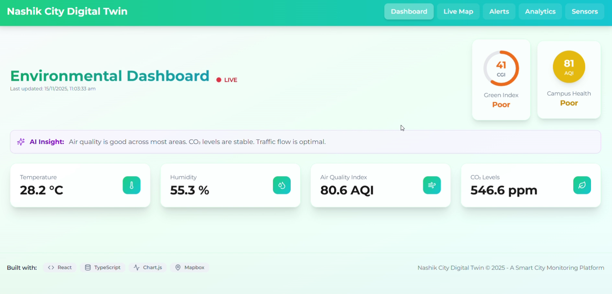
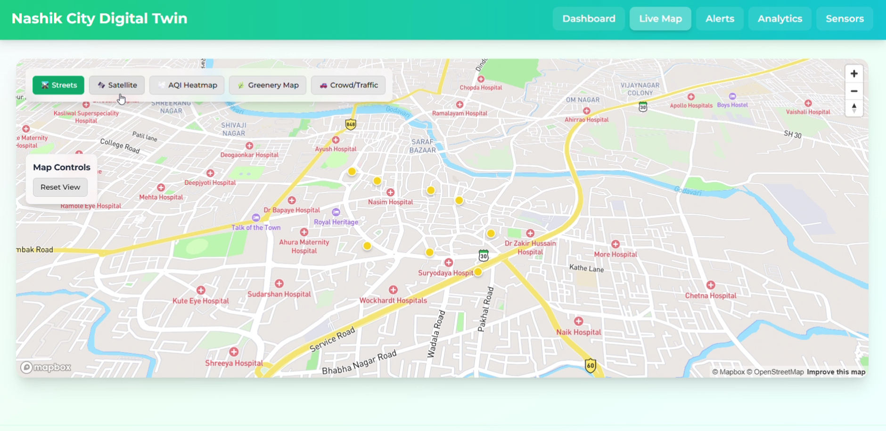
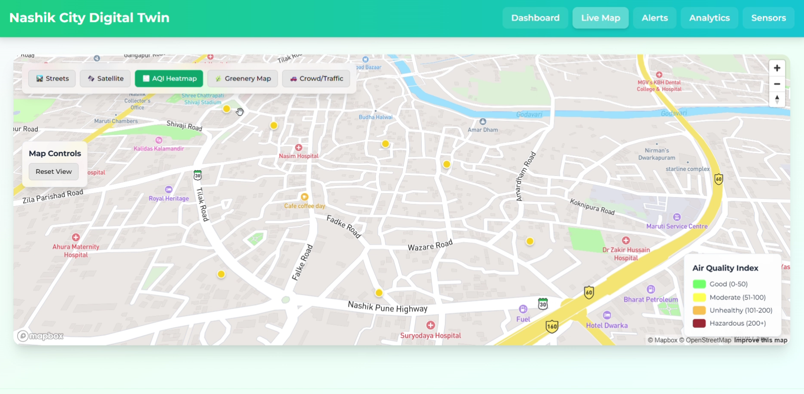
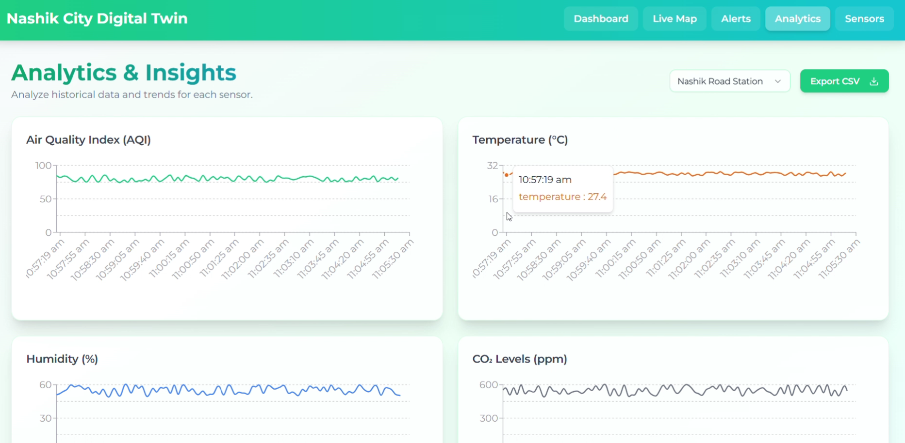
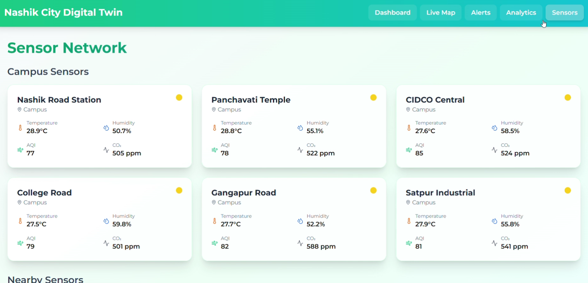

# 🌆 CitiPulse – Real-Time Digital Twin for Smarter & Greener Cities  

## See the Invisible. Predict the Inevitable.

CitiPulse is an AI-driven Real-Time Digital Twin Platform designed to visualize, predict, and mitigate climate-related urban challenges.
It creates a live digital replica of the city—integrating environmental sensors, weather data, 3D mapping, and AI predictions to help authorities, citizens, and planners make data-driven decisions.

Built initially for Nashik, the system monitors flooding, air pollution, heat risks, and traffic insights using real-time geospatial data and intelligent forecasting.

CitiPulse aims at one mission:

See the invisible. Predict the inevitable. Build safer, sustainable cities.

##  Dashboard Preview  
  


---

## ✨ Key Features

### 🌍 **Real-Time 3D Digital Twin**
Live visualization of Nashik city using Mapbox + Unity/Three.js.

### 🌧️ **Flood Forecasting & Alerts**
Predicts rising water levels along Godavari River and displays risk zones.

### 🌫️ **Air Quality + Heatmap Monitoring**
Real-time AQI sensors and dynamic color-coded maps.

### 🚦 **Traffic & Mobility Insights**
Visual congestion zones and future integration with traffic cameras.

### 🔮 **Predictive Analytics**
AI-based risk forecasting for floods, heatwaves, pollution spikes, and landslides.

### ☁️ **Cloud-Based Data Pipeline**
All sensor streams processed through scalable backend infrastructure.

---

## 🌐 Satellite, Street & AQI Layers  


<p float="left">
  
  
</p>

<p align="center">
  
</p>

---

## 🧬 Tech Stack

| Component | Technology |
|----------|------------|
| **3D Visualization** | Mapbox GL, Unity / Three.js |
| **Backend Processing** | Python, Node.js |
| **APIs & Data** | Weather APIs, IoT sensors |
| **AI Models** | ML for flood prediction & analytics |
| **Frontend Dashboard** | JS, Mapbox, HTML/CSS |
| **Cloud Storage** | AWS / Firebase |
| **Data Formats** | GeoJSON, JSON, REST APIs |

---

## 📷 Example Results

### 🔍 Flood & Air Quality Results  


<p float="left" align="center">
  
  
</p>

---

## 🛠️ Installation & Setup

### 1️⃣ Clone the Repository
```bash
git clone https://github.com/your-repo/CitiPulse.git
cd CitiPulse


---

###  Install Dependencies

pip install -r requirements.txt

###  Run Backend Server

uvicorn app.main:app --reload

###  Open Dashboard in Browser

http://127.0.0.1:8000


